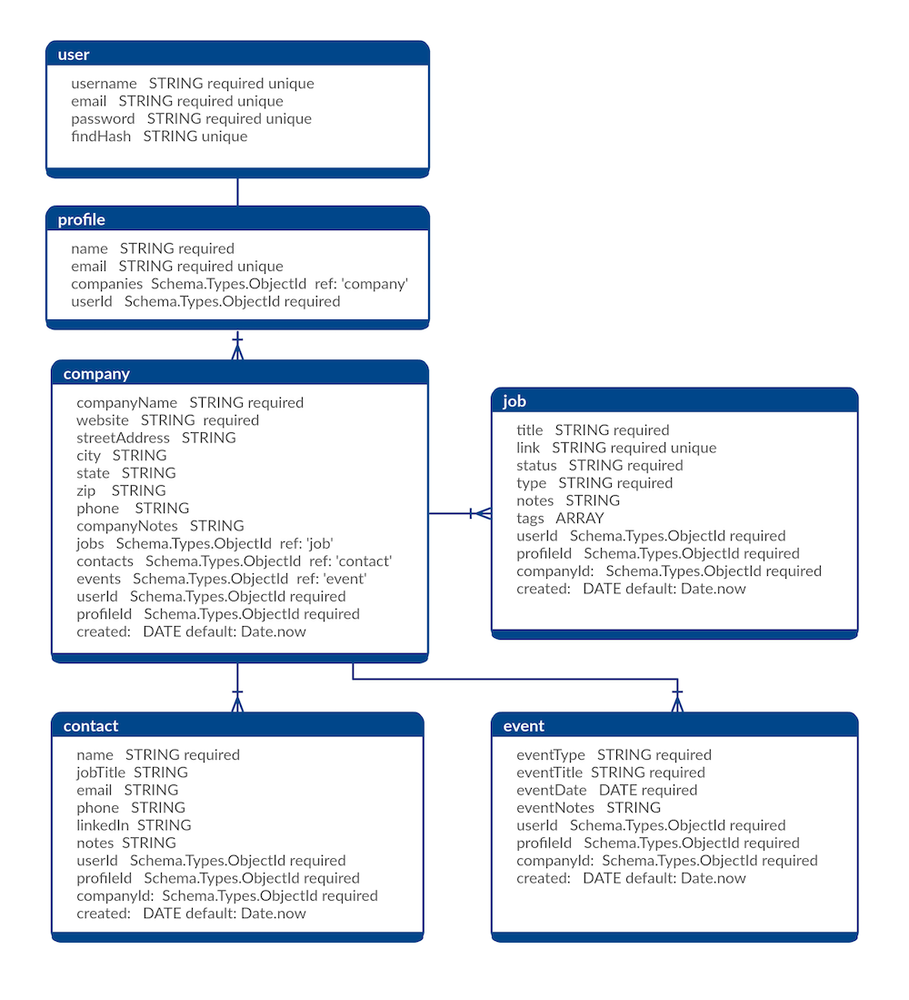

# Job Seeker

## Status
[](https://travis-ci.org/job-seeker/job-seeker-backend)
[](https://coveralls.io/github/job-seeker/job-seeker-backend)
[](https://opensource.org/licenses/MIT)

## Technology Used
* **[Node.js](https://nodejs.org)**
  * Application dependencies:
    * [bcrypt](https://www.npmjs.com/package/bcrypt)
    * [body-parser](https://www.npmjs.com/package/body-parser)
    * [cors](https://www.npmjs.com/package/cors)
    * [coveralls](https://www.npmjs.com/package/coveralls)
    * [debug](https://www.npmjs.com/package/debug)
    * [del](https://www.npmjs.com/package/del)
    * [dotenv](https://www.npmjs.com/package/dotenv)
    * [eslint](https://www.npmjs.com/package/eslint)
    * [express](https://www.npmjs.com/package/express)
    * [http-errors](https://www.npmjs.com/package/http-errors)
    * [istanbul](https://www.npmjs.com/package/istanbul)
    * [jsonwebtoken](https://www.npmjs.com/package/jsonwebtoken)
    * [mongoose](https://www.npmjs.com/package/mongoose)
    * [morgan](https://www.npmjs.com/package/morgan)
  * Developer dependencies:
    * [faker](https://www.npmjs.com/package/faker)
    * [jest](https://www.npmjs.com/package/jest)
    * [superagent](https://www.npmjs.com/package/superagent)
* **[Heroku](https://www.heroku.com/)**
* **[MongoDB](https://www.mongodb.com)** & **[Mongoose](http://mongoosejs.com/)**
* **[TravisCI](https://travis-ci.org/)**
* **[Coveralls](https://coveralls.io)**

## Schema
<h4 align="center"></h4>

## Routes
### **_User_**
#### POST
Create new user with a `username`, `email`, and `password`.
```
POST /api/signup
```
From this POST request, user will receive the following:
```
{
  res.text: < token >
}
```
- With no request body, the server will return a 400 error  

#### GET
Log in as an existing user with a `username` and `password`.
```
GET /api/signin
```
From this GET request, user will receive the following:
```
{
  res.text: < token >
}
```
- With an invalid request body, the server will return a 401 error
- With an invalid username and/or password, the server will return a 500 error

### **_Profile_**
**POST**  
Create a new profile with a valid token, existing `username` and `password`, as well as the new user's `name` and `email`.
```
POST /api/profile
```
From this POST request, user will receive the following:
```
{ 
  name: 'Peter Parker',
  email: 'peter.parker@definitelynotspiderman.com',
  companies: [],
  userId: ' < userId >',
  _id: < new profileId >,
}
```
- With no request body, the server will return a 400 error
- With an invalid username and/or password, the server will return a 404 error
- Without a valid token provided, the server will return a 401 error

#### GET
Fetch an existing user's profile with a valid token and the user's `profileId`.
```
GET /api/profile/:profileId
```
From this GET request, user will receive the following:
```
{
  name: 'Wanda Maximoff',
  email: 'wanda@avengers.com',
  companies: [],
  userId: < userId >,
  _id: < queried profileId >,
}
```
- With an invalid profile ID, the server will return a 404 error
- Without a valid token provided, the server will return a 401 error

#### PUT
Update an existing user's profile with a valid token and the user's `profileId`, as well as the user's new `name` and `email`.
```
PUT /api/profile/:profileId
```
From this GET request, user will receive the following:
```
{ 
  name: 'Peter Parker',
  email: 'peter.parker@avengers.com',
  companies: [],
  userId: < userId >,
  _id: < queried profileId >,
}
```
- With an invalid profile ID, the server will return a 404 error
- Without a valid token provided, the server will return a 401 error
- Without a request body, the server will return a 400 error
  
### **_Company_**
#### POST
```
POST /api/profile/:profileId/company
```

#### GET
```
GET /api/profile/:profileId/company/:companyId
```

#### PUT
```
PUT /api/profile/:profileId/company/:companyId
```

#### DELETE
```
DELETE /api/profile/:profileId/company/:companyId
```

### Job
#### POST
```
POST /api/profile/:profileId/company/:companyId/job
```

#### GET
```
GET /api/profile/:profileId/company/:companyId/job/:jobId
```

#### PUT
```
PUT /api/profile/:profileId/company/:companyId/job/:jobId
```

#### DELETE
```
DELETE /api/profile/:profileId/company/:companyId/job/:jobId
```

### **_Event_**
#### POST
```
POST /api/profile/:profileId/company/:companyId/event
```

#### GET
```
GET /api/profile/:profileId/company/:companyId/event/:eventId
```

#### PUT
```
PUT /api/profile/:profileId/company/:companyId/event/:eventId
```

#### DELETE
```
DELETE /api/profile/:profileId/company/:companyId/event/:eventId
```

### **_Contact_**
#### POST
```
POST /api/profile/:profileId/company/:companyId/contact
```

#### GET
```
GET /api/profile/:profileId/company/:companyId/contact/:contactId
```

#### PUT
```
PUT /api/profile/:profileId/company/:companyId/contact/:contactId
```

#### DELETE
```
DELETE /api/profile/:profileId/company/:companyId/contact/:contactId
```

## Wireframes
<kbd></kbd>
<kbd></kbd>
<kbd></kbd>
<kbd></kbd>

<kbd></kbd>
<kbd></kbd>
<kbd></kbd> 

## Contributors
[Ahmed Ali](https://github.com/AhmedAli93)  

[Alex Bowers](https://github.com/warlordlizard)  

[Melanie Cohen](https://github.com/melaniebcohen)  

[Christian Miller](https://github.com/ruskeezy)